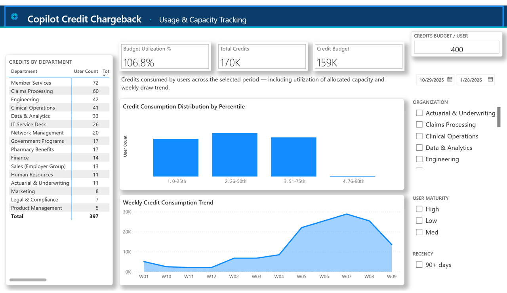

 

# Credit Usage & Chargebacks

### Monitor how Copilot credits are consumed, attribute usage to departments and surface capacity risk across your organization.

 

**All Reports:** [https://microsoft.github.io/Analytics-Hub/](https://microsoft.github.io/Analytics-Hub/)

 

**Found this useful? ⭐ Star this repo to help others discover it!**

 

**[Dashboard Preview ↓](#dashboard-preview)** &nbsp;·&nbsp; **[Instructions ↓](#instructions)** &nbsp;·&nbsp; **[Related Resources ↓](#related-resources)** &nbsp;·&nbsp; **[Email your Admin ↓](#email-your-admin)**

 

---

  
▶️ <b>Credit Usage & Chargebacks Dashboard Preview</b>

   

  

---

<strong>📊 Why Monitor Credit Usage & Insights You Can Explore</strong>

 

Copilot credits are a finite, paid resource. Tracking how they are consumed turns a flat invoice into an accountable, department-level picture. Monitoring credit usage helps you:
- Attribute consumption to the right departments and cost centers
- Spot capacity risk before teams run over their allocation
- Identify heavy and idle-heavy users
- Plan and rebalance capacity ahead of time

 

**Consumption profile:**
How many credits is the organization consuming? How does that split across Cowork, WorkIQ, and Other? What is the average per active user?

**Department attribution:**
Which departments and cost centers are driving consumption? How do credits roll up for chargeback?

**Capacity & alerts:**
Which teams are nearing or exceeding their allocated capacity? Where is Budget Utilization crossing 100%?

**Adoption & risk:**
Who are the heavy users? Who is idle-heavy — holding capacity while inactive — and should be re-engaged or reclaimed?

---

<strong style="font-size:1.5em;">📋 Instructions</strong>

 

<strong>Written Setup Guide</strong>

 

### Step 1. Gather the two data exports (Required for All Setups)

This report is powered by **two CSV exports** that join on the user principal name. No database connection is required — the report reads both files through Power Query parameters.

> **Where to get Export 1 (Copilot credit consumption):**
> **Microsoft 365 Admin Center → Copilot → Cost management → Consumption tab → Export CSV.**

<strong>Detailed field requirements</strong>

 

**Export 1 — Copilot credit consumption** (one row per user):

| Field | Description |
|-------|-------------|
| `User Principal Name` | The user's work email — the join key |
| `Cowork Credits` | Credits consumed in Cowork surfaces |
| `WorkIQ Credits` | Credits consumed in WorkIQ surfaces |
| `Other Credits` | Credits consumed in all other surfaces |
| `Last Activity Date` | Date of the user's most recent Copilot activity |

**Export 2 — Organization directory** (one row per user):

| Field | Description |
|-------|-------------|
| `UserPrincipalName` | The user's work email — the join key |
| `DisplayName` | The user's display name |
| `Department` | Drives department attribution, slicers, and RLS |
| `CostCenter` | Cost center for chargeback roll-up |
| `Manager` | The user's manager |
| `Country` | Country, for geographic slicing |
| `JobFamily` | Job family / role grouping |

> **Do not remove or rename these columns.** Missing a column will cause blank visuals in Power BI with no error. Every user in the credit export should have a matching row in the directory export, or those credits will not be attributed to a department.

### Quick Reference

1. **Produce the credit consumption export**
   - In the **Microsoft 365 Admin Center**, go to **Copilot → Cost management → Consumption** tab and click **Export CSV**.
   - This gives you per-user Copilot credit consumption (Cowork, WorkIQ, Other) plus each user's Last Activity Date.
   - Save as CSV with the exact column names listed above.

2. **Produce the organization directory export**
   - Export the directory mapping each `UserPrincipalName` to `Department`, `CostCenter`, `Manager`, `Country`, and `JobFamily`.
   - Save as CSV with the exact column names listed above.

3. **Open the template in Power BI Desktop**
   - Open the `.pbit` template file.
   - When prompted for parameters, set **`CreditCsvPath`** to the credit consumption CSV and **`OrgCsvPath`** to the organization directory CSV.

4. **Refresh and verify**
   - Click **Refresh**.
   - Confirm the Consumption Overview visuals populate (total credits, active users, average per user) and the Capacity Alerts and Team Adoption pages render.

5. **Set the capacity allocation**
   - Adjust the **Credits Budget / User** input to your organization's per-user allocation so Budget Utilization % and capacity alerts reflect your plan.

---

### Next Steps

<strong>Validation & Troubleshooting</strong>

 

**Checklist for success:**
- No errors on load
- Fields pane includes the expected tables (CreditConsumption, Org)
- Consumption Overview visuals populate (not all blank)

**Common Mistakes & Fixes**

| Symptom | Cause | Fix |
|---------|-------|-----|
| Blank visuals | Missing required column(s) | Re-export with the full column set |
| Missing slicers/labels | No `Department` / `Country` in directory export | Add the attributes and re-export |
| Credits not attributed to a department | UPNs in the credit export have no matching directory row | Reconcile the two exports on user principal name |
| Capacity alerts look wrong | Credits Budget / User not set | Set the per-user allocation input |
| Load error | CSV open in Excel | Close the file and retry |
| Wrong file loaded | Parameter points to the wrong path | Re-check `CreditCsvPath` and `OrgCsvPath` |

<strong>Publish / Distribute</strong>

 

- Save your PBIX file after setup.
- Publish to a Power BI workspace: **File → Publish → Publish to Power BI**.
- For CSV Import, note that refreshes are manual — re-export and re-point the file to update.

<strong>Interpretation & Storytelling</strong>

 

Use the included guide to frame your narrative and drive action:

- **Storyboard presentation template:** `Chargebacks Interpretation Guide.pptx`

Use the guide to:
- Create a leadership-ready capacity & usage review
- Define how your organization allocates credit capacity per user
- Highlight departments trending toward their capacity limit
- Recommend rebalancing and re-engagement actions per department

<strong>Monitor with Refresh</strong>

 

- For CSV Import: re-export the two CSVs on your cadence (e.g. monthly), overwrite the files, and refresh the report.
- Verify each period that a fresh window of credit data appears.
- Track capacity utilization and idle-heavy users regularly so owners can act before overruns.

<strong>Row Level Security (RLS) — Restrict Who Sees What</strong>

 

Row Level Security (RLS) controls which rows of data each viewer can see — for example, showing a department lead only their own department's credit usage. This report ships with two roles. Setup happens in two places: **Power BI Desktop** (define roles) and **Microsoft Fabric** (assign members).

This report's roles:

| Role | What it sees |
|------|--------------|
| **All Org (Admin)** | Unrestricted — every department. For finance and program leads. |
| **Department Admin** | Only the viewer's own department, via a `USERPRINCIPALNAME()` filter on the `SecurityFilter` table. |

### Step 1 — Define roles in Power BI Desktop

1. Open the report in **Power BI Desktop**.
2. Go to the **Modeling** tab → click **Manage roles**.
3. The `All Org (Admin)` and `Department Admin` roles are already defined. To add or adjust a department-scoped filter, use a DAX filter that returns `TRUE` for the rows the role may see.

   **Common filters:**

   | Goal | DAX filter |
   |------|-----------|
   | Filter by Department | `Org[Department] = "Finance"` |
   | Filter by Country | `Org[Country] = "US"` |
   | Show only the viewer's own department | `SecurityFilter[UserPrincipalName] = USERPRINCIPALNAME()` |

4. Click **Save**.
5. **Test (recommended):** in the **Modeling** tab, click **View as**, select a role, and confirm the report filters correctly. Click **Stop viewing** when done.

### Step 2 — Publish the report

Publish as normal: **File → Publish → Publish to Power BI** and select your workspace. The roles you defined are included automatically.

### Step 3 — Assign members to roles in Microsoft Fabric

1. Go to [app.fabric.microsoft.com](https://app.fabric.microsoft.com) and open your workspace.
2. Find the **semantic model** (dataset icon — not the report itself).
3. Click the **three-dot menu (...)** next to it and select **Security**.
4. On the left, click a role name. On the right, search for a person's name, email address, or Azure AD security group, then click **Add**.
5. Repeat for all roles, then click **Save**.

> **Tip:** Use Azure AD security groups rather than individual emails. When someone joins or leaves a team, you update access in Azure AD instead of returning to Fabric.

**Important notes:**
- Workspace admins and report owners always see all data — RLS does not apply to them.
- A viewer with no role assigned sees no data at all. Make sure every intended viewer is in at least one role.
- A viewer assigned to multiple roles sees the union of access from all roles (OR logic, not AND).
- RLS applies to all reports built on the same semantic model.

---

<strong>🤓 Nerd Corner</strong>

 

The report's two source paths are exposed as Power Query parameters — `CreditCsvPath` and `OrgCsvPath` — so swapping in a fresh extract is a parameter change and a refresh, with no model edits. Department attribution, capacity alerts, and the heavy / idle-heavy cohorts all derive from the same star schema: a single `CreditConsumption` fact joined one-to-many to the `Org` directory on user principal name.

---

<strong>💬 Feedback</strong>

 

We want to hear your feedback and suggestions. Please reach out to jordanking@microsoft.com.

---

<strong>🔔 Stay Updated</strong>

 

- ⭐ **Star this repository** to receive notifications about new template versions
- 👀 **Watch** for updates and announcements
- 🔄 Check back regularly for new features and improvements

---

## 🔗 Related Templates & Tools

**Additional Resources:** [Analytics Hub](https://microsoft.github.io/Analytics-Hub/)

📥 **[Click Here to Download All Files](https://github.com/microsoft/CreditUsage/archive/refs/heads/main.zip)**

---

## 📧 Email Your Admin

> 📧 **Before you begin, you need two data exports: a Copilot credit consumption export and an organization directory export.**
> This pre-written email covers both required exports, the exact fields, the roles and permissions needed to produce them, software requirements, and the connection option — everything your admin needs in one click.

> **[📨 Email Prerequisites to Your IT Admin](mailto:?subject=Action%20Required%3A%20Data%20Export%20Needed%20for%20Credit%20Usage%20%26%20Chargebacks%20Report%20%28Power%20BI%29&body=To%3A%20IT%20Admin%20/%20Microsoft%20365%20Copilot%20Administrator%20/%20Data%20Owner%0ARe%3A%20Credit%20Usage%20%26%20Chargebacks%20%28CreditUsage%29%20-%20Power%20BI%20Report%20Setup%0A%0A%0AWHAT%20THIS%20REPORT%20DOES%0A%0AThe%20Credit%20Usage%20%26%20Chargebacks%20report%20is%20a%20Power%20BI%20report%20that%20monitors%20Copilot%0Acredit%20consumption%20across%20the%20organization.%20It%20attributes%20credits%20to%20departments%0Aand%20cost%20centers%2C%20tracks%20each%20team%27s%20usage%20against%20its%20allocated%20capacity%2C%20and%0Asurfaces%20heavy%20and%20idle-heavy%20users%20so%20owners%20can%20rebalance%20capacity%20and%20focus%0Aenablement.%20To%20build%20it%2C%20I%20need%20two%20data%20exports%20described%20below.%0A%0A%0ADATA%20SOURCES%20REQUIRED%0A%0A1.%20Copilot%20credit%20consumption%20export%20%28per-user%20credit%20breakdown%29%0A2.%20Organization%20directory%20export%20%28maps%20each%20user%20to%20a%20department%20and%20cost%20center%29%0A%0AFormat%3A%20CSV%20%28one%20row%20per%20user%29.%20The%20report%20connects%20to%20both%20files%20via%20two%20Power%0AQuery%20parameters%20-%20no%20database%20connection%20required.%0A%0A%0AREQUIRED%20FIELDS%20-%20DO%20NOT%20REMOVE%20OR%20RENAME%0A%0AExport%201%20-%20Copilot%20credit%20consumption%20%28one%20row%20per%20user%29%3A%0A-%20User%20Principal%20Name%0A-%20Cowork%20Credits%0A-%20WorkIQ%20Credits%0A-%20Other%20Credits%0A-%20Last%20Activity%20Date%0A%0AExport%202%20-%20Organization%20directory%20%28one%20row%20per%20user%29%3A%0A-%20UserPrincipalName%0A-%20DisplayName%0A-%20Department%0A-%20CostCenter%0A-%20Manager%0A-%20Country%0A-%20JobFamily%0A%0AThe%20two%20files%20join%20on%20the%20user%20principal%20name.%20Every%20user%20in%20the%20credit%20export%0Ashould%20have%20a%20matching%20row%20in%20the%20directory%20export%2C%20or%20those%20credits%20will%20not%20be%0Aattributed%20to%20a%20department.%0A%0A%0AINSIGHTS%20THIS%20REPORT%20PROVIDES%0A%0A-%20Consumption%20overview%3A%20total%20credits%2C%20active%20users%2C%20and%20average%20credits%20per%20user%0A-%20Surface%20breakdown%3A%20how%20credits%20split%20across%20Cowork%2C%20WorkIQ%2C%20and%20Other%0A-%20Capacity%20alerts%3A%20which%20departments%20are%20near%20or%20over%20their%20allocated%20capacity%0A-%20Heavy%20and%20idle-heavy%20users%3A%20who%20consumes%20the%20most%2C%20and%20who%20holds%20capacity%20while%0A%20%20inactive%0A-%20Department%20attribution%3A%20credits%20rolled%20up%20by%20department%20and%20cost%20center%20for%0A%20%20chargeback%0A%0A%0AROLES%20%26%20PERMISSIONS%20REQUIRED%0A%0A-%20Produce%20the%20Copilot%20credit%20consumption%20export%3A%20Microsoft%20365%20Copilot%20/%20billing%0A%20%20administrator%0A-%20Produce%20the%20organization%20directory%20export%3A%20HR%20/%20identity%20/%20directory%20owner%0A-%20Open%20and%20configure%20the%20template%3A%20Power%20BI%20Desktop%20user%0A%0A%0ASOFTWARE%20REQUIREMENTS%0A%0A-%20Power%20BI%20Desktop%20-%20required%20to%20open%20the%20.pbit%20template%20file%0A-%20Access%20to%20the%20Copilot%20consumption%20data%20and%20the%20organization%20directory%0A%0A%0ACONNECTION%20OPTION%0A%0ACSV%20Import%20%28.pbit%29%3A%20place%20the%20two%20exports%20on%20disk%2C%20open%20the%20template%2C%20and%20set%20the%0ACreditCsvPath%20and%20OrgCsvPath%20parameters%20to%20the%20two%20file%20paths.%20Refresh%20to%20load.%0A%0A%0APlease%20reply%20with%20the%20two%20CSV%20exports%20%28or%20the%20file%20paths%29%20and%20I%20will%20complete%20the%0Asetup.)**

---

**Found this useful? ⭐ Star this repo to help others discover it!**

That's it! 🚀
