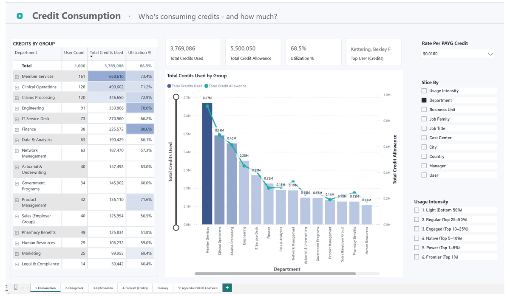

 

# Credit Usage & Chargebacks

### Monitor how Copilot credits are consumed, attribute usage to departments and surface capacity risk across your organization.

 

**All Reports:** [https://microsoft.github.io/Analytics-Hub/](https://microsoft.github.io/Analytics-Hub/)

 

**Found this useful? ⭐ Star this repo to help others discover it!**

 

**[Dashboard Preview ↓](#dashboard-preview)** &nbsp;·&nbsp; **[Instructions ↓](#instructions)** &nbsp;·&nbsp; **[Related Resources ↓](#related-resources)** &nbsp;·&nbsp; **[Email your Admin ↓](#email-your-admin)** &nbsp;·&nbsp; **[Live Web Apps ↗](https://microsoft.github.io/Analytics-Hub/cowork-billing/)**

 

---

  
▶️ <b>Credit Usage & Chargebacks Dashboard Preview</b>

   

  

---

<strong>📊 Why Monitor Credit Usage & Insights You Can Explore</strong>

 

Copilot credits are a finite, paid resource. Tracking how they are consumed turns a flat invoice into an accountable, department-level picture. Monitoring credit usage helps you:
- Attribute consumption to the right departments and cost centers
- Spot users trending over their monthly credit limit before overruns
- Recognize standout individuals and understand usage cohorts
- Rebalance credit allocation from under-utilized to over-limit teams

 

**Consumption profile:**
How many credits is the organization consuming against its credit limit? What is the utilization %? How does usage break down by sessions and % used per user?

**Department attribution:**
Which departments and cost centers are driving consumption? How do credits roll up for chargeback at $0.01 per credit?

**Over-limit & budget status:**
Which teams are nearing or exceeding their monthly credit limit? Where is utilization crossing 100%, and what is the over-limit chargeback?

**Cohorts & standouts:**
Which usage cohort does each user fall into? Who are the standout individuals — high relative to their department average — worth recognizing or investigating?

---

<strong style="font-size:1.5em;">📋 Instructions</strong>

 

<strong>Written Setup Guide</strong>

 

### Step 1. Gather the two data exports (Required for All Setups)

This report is powered by **two CSV exports** that join on the user principal name. No database connection is required — the report reads both files through Power Query parameters.

> **Where to get Export 1 (Copilot credit consumption):**
> **Microsoft 365 Admin Center → Copilot → Cost management → Consumption tab → Export CSV.**
>
> **Where to get Export 2 (Microsoft Entra org directory):**
> **Microsoft Entra admin center → Identity → Users → All users → Download users** (CSV), or pull the same attributes from **Microsoft Graph** (`GET /users`). Entra supplies each user's department, job title, country, and manager — the org context the credit export does not contain.

<strong>Detailed field requirements</strong>

 

**Export 1 — Copilot credit consumption** (one row per user):

| Field | Description |
|-------|-------------|
| `Display Name` | The user's display name |
| `User Principal Name` | The user's work email — the join key |
| `Monthly credit limit` | The user's monthly credit allocation |
| `Monthly credits used` | Credits the user consumed this month |
| `User ID` | The user's object identifier |
| `Microsoft 365 Copilot license` | Whether the user holds a Copilot license |
| `Last activity date` | Date of the user's most recent Copilot activity |
| `Session Count` | Number of Copilot sessions in the period |
| `% Used` | Monthly credits used as a percentage of the limit |

> This is a single credit stream — usage is not broken out by surface. Each user's monthly credit limit comes from this export, so there is no manual budget input to set.

**Export 2 — Microsoft Entra org directory** (one row per user):

| Field | Description |
|-------|-------------|
| `userPrincipalName` | The user's work email — the join key |
| `displayName` | The user's display name |
| `department` | Drives department attribution, slicers, and RLS |
| `jobTitle` | Job title |
| `jobFamily` | Job-family grouping (org-specific — see note) |
| `city` | City, for geographic slicing |
| `country` | Country, for geographic slicing |
| `costCenter` | Cost center, for chargeback rollup (org-specific — see note) |
| `manager` | The user's manager (UPN or display name) |
| `businessUnit` | Business unit, for rollup (org-specific — see note) |

> `department`, `jobTitle`, `city`, `country`, and `manager` come straight from a standard Microsoft Entra **Download users** / Microsoft Graph (`GET /users`) export, so those columns work as-is. **Do not rename these columns.** Missing a column will cause blank visuals in Power BI with no error. Every user in the credit export should have a matching row in the Entra export, or those credits will not be attributed to a department.
>
> **Note:** `jobFamily`, `costCenter`, and `businessUnit` are **not** standard Entra fields — an admin must add or map them (for example from an HR feed), or the cost-center and business-unit slicers stay blank.

### Quick Reference

1. **Produce the credit consumption export**
   - In the **Microsoft 365 Admin Center**, go to **Copilot → Cost management → Consumption** tab and click **Export CSV**.
   - This gives you per-user Copilot credit consumption — a single credit stream with each user's monthly credit limit, monthly credits used, session count, % used, and last activity date.
   - Save as CSV with the exact column names listed above.

2. **Produce the Microsoft Entra org directory export**
   - In the **Microsoft Entra admin center**, go to **Identity → Users → All users → Download users** (or pull the same attributes from **Microsoft Graph** `GET /users`).
   - This maps each `userPrincipalName` to `department`, `jobTitle`, `city`, `country`, and `manager` — the org context the credit export lacks. (`jobFamily`, `costCenter`, and `businessUnit` are org-specific add-ons — see the field note above.)
   - Save as CSV with the exact column names listed above.

3. **Open the template in Power BI Desktop**
   - Open the `.pbit` template file.
   - When prompted for parameters, set **`CreditCsvPath`** to the credit consumption CSV and **`EntraCsvPath`** to the Microsoft Entra directory CSV.

4. **Refresh and verify**
   - Click **Refresh**.
   - Confirm the Consumption visuals populate (total credits used, total credit allowance, utilization %, top user by credits) and that all 6 report pages render.
   - The per-user monthly credit limit comes from Export 1, so there is no manual budget input to set.

### The report pages

1. **Consumption** - org KPIs (total credits used, total credit allowance, utilization %, top user by credits) over a credits-by-group table and a used-vs-allowance chart.
2. **Chargeback (PayGo)** - the per-department PayGo view: users over limit, % users over limit, credits over limit, and the resulting chargeback, ranked in a chargeback-by-group chart. Chargeback is billed on the consumption a group runs above its allowance (PayGo overage).
3. **Prepaid Allocation** - set your three inputs (rate per credit, prepaid rate, prepaid credits procured), then choose a **prepaid credits allocation model** - **Prorated based on credits used**, **Prorated based on employee count**, or **Limited to budgeted allowances** - to split the pool across departments, where each department pays for what the pool covers plus any overage (billed PAYGO). Pool-coverage KPIs (total usage, prepaid pool, usage covered by prepaid pool %, not covered by prepaid credits, total cost, estimated overage) sit above a covered-vs-gap chart and a per-department table (users, credits used, covered by prepaid, overage PAYGO, total charge).
4. **Optimization** - a utilization-band chart (Under 50% through Over 100%), an all-user watchlist sorted by % of limit, and a decrease-allowance table of top unused credits to spot allowance-adjustment candidates.
5. **Forecast (Credits)** - projected monthly credits over a configurable horizon (usage growth, user growth, time period, monthly prepaid), with current-vs-projected credits and utilization-vs-capacity.
6. **Glossary** - definitions plus data and honesty notes.

---

### Next Steps

<strong>Validation & Troubleshooting</strong>

 

**Checklist for success:**
- No errors on load
- Fields pane includes the expected tables (`CoworkBilling`, `Org`)
- Consumption visuals populate (not all blank)

**Common Mistakes & Fixes**

| Symptom | Cause | Fix |
|---------|-------|-----|
| Blank visuals | Missing required column(s) | Re-export with the full column set |
| Missing slicers/labels | No `department` / `country` in directory export | Add the attributes and re-export |
| Credits not attributed to a department | UPNs in the credit export have no matching directory row | Reconcile the two exports on user principal name |
| Utilization or over-limit looks wrong | `Monthly credit limit` missing from the credit export | Re-export Export 1 with the monthly credit limit column |
| Load error | CSV open in Excel | Close the file and retry |
| Wrong file loaded | Parameter points to the wrong path | Re-check `CreditCsvPath` and `EntraCsvPath` |

<strong>Publish / Distribute</strong>

 

- Save your PBIX file after setup.
- Publish to a Power BI workspace: **File → Publish → Publish to Power BI**.
- For CSV Import, note that refreshes are manual — re-export and re-point the file to update.

<strong>Interpretation & Storytelling</strong>

 

Use the included guide to frame your narrative and drive action:

- **Storyboard presentation template:** `Chargebacks Interpretation Guide.pptx`

Use the guide to:
- Create a leadership-ready credit usage & chargeback review
- Explain how chargeback is calculated at $0.01 per credit
- Highlight departments trending toward their monthly credit limit
- Recommend reallocation and recognition actions per department

<strong>Monitor with Refresh</strong>

 

- For CSV Import: re-export the two CSVs on your cadence (e.g. monthly), overwrite the files, and refresh the report.
- Verify each period that a fresh window of credit data appears.
- Track utilization and over-limit users regularly so owners can act before overruns.

<strong>Row Level Security (RLS) — Restrict Who Sees What</strong>

 

Row Level Security (RLS) controls which rows of data each viewer can see — for example, showing a department lead only their own department's credit usage. This report ships with two roles. Setup happens in two places: **Power BI Desktop** (define roles) and **Microsoft Fabric** (assign members).

This report's roles:

| Role | What it sees |
|------|--------------|
| **All Org (Admin)** | Unrestricted — every department. For finance and program leads. |
| **Department Admin** | Only the viewer's own department, via a `USERPRINCIPALNAME()` filter on the `SecurityFilter` table. |

### Step 1 — Define roles in Power BI Desktop

1. Open the report in **Power BI Desktop**.
2. Go to the **Modeling** tab → click **Manage roles**.
3. The `All Org (Admin)` and `Department Admin` roles are already defined. To add or adjust a department-scoped filter, use a DAX filter that returns `TRUE` for the rows the role may see.

   **Common filters:**

   | Goal | DAX filter |
   |------|-----------|
   | Filter by Department | `Org[Department] = "Finance"` |
   | Filter by Country | `Org[Country] = "US"` |
   | Show only the viewer's own department | `SecurityFilter[UserPrincipalName] = USERPRINCIPALNAME()` |

4. Click **Save**.
5. **Test (recommended):** in the **Modeling** tab, click **View as**, select a role, and confirm the report filters correctly. Click **Stop viewing** when done.

### Step 2 — Publish the report

Publish as normal: **File → Publish → Publish to Power BI** and select your workspace. The roles you defined are included automatically.

### Step 3 — Assign members to roles in Microsoft Fabric

1. Go to [app.fabric.microsoft.com](https://app.fabric.microsoft.com) and open your workspace.
2. Find the **semantic model** (dataset icon — not the report itself).
3. Click the **three-dot menu (...)** next to it and select **Security**.
4. On the left, click a role name. On the right, search for a person's name, email address, or Azure AD security group, then click **Add**.
5. Repeat for all roles, then click **Save**.

> **Tip:** Use Azure AD security groups rather than individual emails. When someone joins or leaves a team, you update access in Azure AD instead of returning to Fabric.

**Important notes:**
- Workspace admins and report owners always see all data — RLS does not apply to them.
- A viewer with no role assigned sees no data at all. Make sure every intended viewer is in at least one role.
- A viewer assigned to multiple roles sees the union of access from all roles (OR logic, not AND).
- RLS applies to all reports built on the same semantic model.

---

<strong>🤓 Nerd Corner</strong>

 

The report's two source paths are exposed as Power Query parameters — `CreditCsvPath` and `EntraCsvPath` — so swapping in a fresh extract is a parameter change and a refresh, with no model edits. Department attribution, over-limit tracking, the usage cohorts, and standout individuals all derive from the same star schema: a single `CoworkBilling` fact (27 measures) joined many-to-one to the `Org` directory (sourced from Microsoft Entra) on user principal name, alongside an `Assumptions` table holding the sole money knob (`RatePerCredit`, $0.01 per credit) and a `SecurityFilter` table for RLS.

---

<strong>💬 Feedback</strong>

 

We want to hear your feedback and suggestions. Please reach out to jordanking@microsoft.com.

---

<strong>🔔 Stay Updated</strong>

 

- ⭐ **Star this repository** to receive notifications about new template versions
- 👀 **Watch** for updates and announcements
- 🔄 Check back regularly for new features and improvements

---

## Changelog

All notable changes to the Cowork Credit Chargeback template and report.

### 2026-08-18

**Changed**
- **Chargeback is now billed on consumption above allowance (PayGo overage).** Under the 22 Jul 2026 Cowork spending-policy change, per-user spending limits are soft - the task still completes and the excess is not billed - so the Chargeback page now reflects PayGo overage rather than a figure that is never invoiced.
- **Prepaid allocation "Limited to budgeted allowances" now respects the pool.** The model previously ignored the prepaid pool and could report coverage above the pool size; total coverage is now capped at the procured pool.

**Removed**
- **Billing Models page** and **Appendix: FOCUS Cost View** - no longer part of the report.

### 2026-07-23

**Added**
- **Billing Models page** - compare the same monthly consumption under PAYGO, Prepaid (credit-pack), and Hybrid pricing per department, with an adjustable prepaid-rate slider and a cheapest-model flag.
- **Prepaid Allocation page** - enter a procured prepaid credit pool (e.g. 2M credits) and see, per department, how it is allocated (priority fill), what is covered, and where the pay-as-you-go (PAYGO) gap falls; pool-coverage KPIs and a covered-vs-gap chart.
- **Optimization & Limits** (renamed from "Optimization") - a utilization-band chart (Under 50% through Over 100%) and an all-user watchlist sorted by % of limit, to surface users approaching or over their allowance.

**Changed**
- Unified the page banner (white header) across every page for a consistent look.
- Softened the report color palette to a muted / pastel scheme.

**Model**
- New what-if parameters: **Prepaid Rate per Credit** and **Prepaid Credits Procured**.
- New measures for the billing-model comparison and prepaid-pool allocation (fair-share and priority-fill), plus **Utilization Band** columns.

### 2026-07-16 - Baseline

- Initial Cowork Credit Chargeback template: two-CSV Power Query load (Copilot consumption + Microsoft Entra directory), RLS-ready model, executive / department / cost-center chargeback, credit optimization, forecast, glossary, and a FOCUS cost appendix.

---

## 🔗 Related Templates & Tools

**Additional Resources:** [Analytics Hub](https://microsoft.github.io/Analytics-Hub/)

📥 **[Click Here to Download All Files](https://github.com/microsoft/CreditUsage/archive/refs/heads/main.zip)**

---

## 📧 Email Your Admin

> 📧 **Before you begin, you need two data exports: a Copilot credit consumption export (Microsoft 365 Admin Center → Copilot → Cost management) and a Microsoft Entra org directory export (Entra admin center → Users → Download users).**
> This pre-written email covers both required exports, the exact fields, the roles and permissions needed to produce them, software requirements, and the connection option — everything your admin needs in one click.

> **[📨 Email Prerequisites to Your IT Admin](mailto:?subject=Action%20Required%3A%20Data%20Export%20Needed%20for%20Credit%20Usage%20%26%20Chargebacks%20Report%20%28Power%20BI%29&body=To%3A%20IT%20Admin%20/%20Microsoft%20365%20Copilot%20Administrator%20/%20Data%20Owner%0ARe%3A%20Credit%20Usage%20%26%20Chargebacks%20%28CreditUsage%29%20-%20Power%20BI%20Report%20Setup%0A%0A%0AWHAT%20THIS%20REPORT%20DOES%0A%0AThe%20Credit%20Usage%20%26%20Chargebacks%20report%20is%20a%20Power%20BI%20report%20that%20monitors%20Copilot%0Acredit%20consumption%20across%20the%20organization.%20It%20attributes%20credits%20to%20departments%0Aand%20cost%20centers%2C%20tracks%20each%20team%27s%20usage%20against%20its%20monthly%20credit%20limit%2C%20and%0Asurfaces%20over-limit%20teams%20and%20standout%20individuals%20so%20owners%20can%0Areallocate%20credits%20and%20focus%20recognition.%20To%20build%20it%2C%20I%20need%20two%20data%20exports%20described%20below.%0A%0A%0ADATA%20SOURCES%20REQUIRED%0A%0A1.%20Copilot%20credit%20consumption%20export%20%28per-user%20credit%20breakdown%29%0A2.%20Microsoft%20Entra%20org%20directory%20export%20%28maps%20each%20user%20to%20department%2C%20job%20title%2C%20country%2C%20and%20manager%29%0A%0AFormat%3A%20CSV%20%28one%20row%20per%20user%29.%20The%20report%20connects%20to%20both%20files%20via%20two%20Power%0AQuery%20parameters%20-%20no%20database%20connection%20required.%0A%0A%0AREQUIRED%20FIELDS%20-%20DO%20NOT%20REMOVE%20OR%20RENAME%0A%0AExport%201%20-%20Copilot%20credit%20consumption%20%28one%20row%20per%20user%29%3A%0A-%20User%20Principal%20Name%0A-%20Monthly%20credit%20limit%0A-%20Monthly%20credits%20used%0A-%20Microsoft%20365%20Copilot%20license%0A-%20Last%20activity%20date%0A-%20Session%20Count%0A%0AExport%202%20-%20Microsoft%20Entra%20org%20directory%20%28one%20row%20per%20user%29%3A%0A-%20userPrincipalName%0A-%20displayName%0A-%20department%0A-%20jobTitle%0A-%20city%0A-%20country%0A-%20manager%0A%0A%28jobFamily%2C%20costCenter%2C%20and%20businessUnit%20are%20org-specific%20add-ons%20-%20not%20standard%20Entra%20fields%29%0A%0AThe%20two%20files%20join%20on%20the%20user%20principal%20name.%20Every%20user%20in%20the%20credit%20export%0Ashould%20have%20a%20matching%20row%20in%20the%20directory%20export%2C%20or%20those%20credits%20will%20not%20be%0Aattributed%20to%20a%20department.%0A%0A%0AINSIGHTS%20THIS%20REPORT%20PROVIDES%0A%0A-%20Executive%20overview%3A%20total%20credits%20used%2C%20credit%20limit%2C%20utilization%20%25%2C%20and%20chargeback%20%24%0A-%20Utilization%20detail%3A%20monthly%20credits%20used%20vs%20limit%2C%20sessions%2C%20and%20%25%20used%20per%20user%0A-%20Over-limit%20status%3A%20which%20departments%20are%20near%20or%20over%20their%20monthly%20credit%20limit%0A-%20Usage%20cohorts%20and%20standout%20individuals%3A%20how%20each%20user%20ranks%20by%20monthly%20credits%20used%2C%0A%20%20and%20who%20stands%20out%20vs%20their%20department%20average%0A-%20Department%20attribution%3A%20credits%20rolled%20up%20by%20department%20and%20cost%20center%20for%0A%20%20chargeback%0A%0A%0AROLES%20%26%20PERMISSIONS%20REQUIRED%0A%0A-%20Produce%20the%20Copilot%20credit%20consumption%20export%3A%20Microsoft%20365%20Copilot%20/%20billing%0A%20%20administrator%0A-%20Produce%20the%20Microsoft%20Entra%20org%20directory%20export%3A%20identity%20/%20directory%20owner%0A-%20Open%20and%20configure%20the%20template%3A%20Power%20BI%20Desktop%20user%0A%0A%0ASOFTWARE%20REQUIREMENTS%0A%0A-%20Power%20BI%20Desktop%20-%20required%20to%20open%20the%20.pbit%20template%20file%0A-%20Access%20to%20the%20Copilot%20consumption%20data%20and%20the%20Microsoft%20Entra%20directory%0A%0A%0ACONNECTION%20OPTION%0A%0ACSV%20Import%20%28.pbit%29%3A%20place%20the%20two%20exports%20on%20disk%2C%20open%20the%20template%2C%20and%20set%20the%0ACreditCsvPath%20and%20EntraCsvPath%20parameters%20to%20the%20two%20file%20paths.%20Refresh%20to%20load.%0A%0A%0APlease%20reply%20with%20the%20two%20CSV%20exports%20%28or%20the%20file%20paths%29%20and%20I%20will%20complete%20the%0Asetup.)**

---

**Found this useful? ⭐ Star this repo to help others discover it!**

That's it! 🚀
